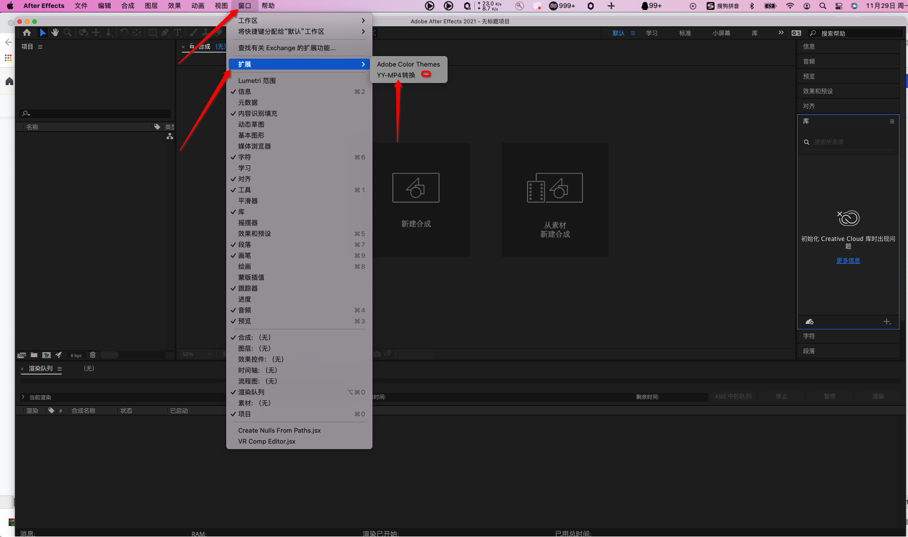

# EVA-AE-Conveter 插件介绍

      
  **我们的这套工具是使用AE扩展的方式来完成**
   
 插件包: [YYYSMP4Conveter.zxp](./build-2.0.7)
 
 ## 设计使用教程
 
  插件包含2个模块
  
   1.导出普通MP4资源
   
   2.导出混合MP4资源
   
  ### step1 : 环境准备
  
  * 安装YYConvertMP插件

      * 先安装[ZXP安装工具](https://aescripts.com/learn/zxp-installer/)，然后将插件安装包[YYYSMP4Conveter.zxp](./build-2.0.7) 拖进 [ZXP安装工具](https://aescripts.com/learn/zxp-installer/)主界面
      * 下图表示插件安装成功 
      * 检查插件是否安装成功: 

            1.重启 AE 
            2.选择 窗口 -》 扩展 
            3.检查是否 多出一个 ”YY-MP4转换“ 的工具 
* **创建创建YYConvertMP4模板 （必须步骤）**
    
    * 打开AE，选择编辑-》模块-》输出模块 

    * 按如下步骤创建YYConvertMP4输出模板 
  
  

  ### step2 : 导出普通MP4资源
  
  该模块是给AE扩充了 渲染 MP4资源的能力
  
  * 选择一个合成
  * 

  
  
  ### step3 : 导出混合MP4资源 

